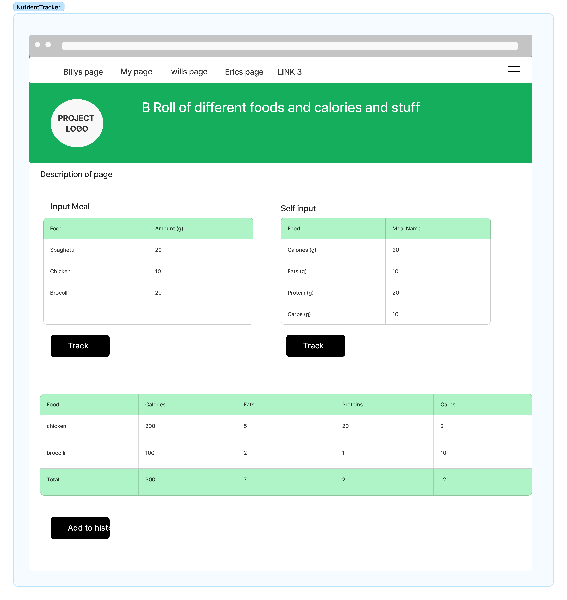

### Billy

#### Page Title: Login/Create Account/Forgot Password

#### Page Description: These pages will handle user verification or account creation, store that data in a database, and pass information for other pages to use. 

#### Parameters needed for the page: These pages will receive a number of parameters to include, First Name, Last Name, Date of Birth, Gender, Username, E-mail.

#### Data needed to render the page: No real data will be required to render this page. Instead this page will receive and verify data before passing to an index page.

#### Link destinations for the page: This page will connect to each of the Login/Create Account/Forgot Password pages then link directly to the index page.

#### List of tests for verifying the rendering of the page: Tests will include data input validation, a test for adding to an existing database, creating a database if one does not exist, and a test for editing a database entry.

### Dylan

#### Page Title: Nutrient Tracker (URL: nutrients (?))

#### Page Description: This page is going to be where you input the food you’ve eaten and get a breakdown of the calories and macro nutrients within that food. There is the option to either input the different foods within a meal or to input your own meal and add the nutrient info yourself. This second option will allow for different meals since there are an almost infinite amount of them. This can then be added to the database where we track the nutrient values of different foods. The page will also have a table displaying the total nutrient values consumed for the day that will be filled out (with a running total) when you enter food in. That table will also have the option to push the data to your nutrient tracking database which allows you to keep track of your nutrients over time. 

#### Parameters needed for the page: The parameters taken in on this page will be string inputs for food, selector buttons to calculate inputs and add calculated results to history database.

#### Data needed to render the page: A large function of this page is to track user nutrient history, so it will need to data for user information so that individuals data can be tracked. It will need to have the date (get without input somehow?) so that the tracking follows time. It will also have to have access to food nutrient info database so that amounts of food eaten can be translated to nutrient information on the page. This allows users who just want to see nutrient info of a specific food to input something once and not have to login. 

#### Link destinations for the page: This page will link to all other pages via the nav bar at the top and will also link to a page that has a table with the users nutrient and workout history as well as analytics to track nutrient and excersize activity.

#### List of tests for verifying the rendering of the page: 
# type validation so that only correct information can be input. 
# database access validation to ensure correct information is being recieved and input. 
# link validation to ensure that links go to the correct page. 
# testing to ensure that user data is stored through time. 
# Tests to ensure that user food input to the database is reasonable so that our database isn't being filled with nonsensical entries that waste space. 

### Eric

#### Page Title: Exercise Input

#### Page Description: https://coding.csel.io/hub/user-redirect/lab/tree/3308/CSPB-3308-Team-3/images/wireframe_images/Exercise%20input%20wireframe%20(1).png

#### Parameters needed for the page: The parameters taken in on this page will be inputs for date, selector buttons for cardio or strength training, string input for exercise performed, integer input for cardio duration or integer input for sets/reps performed, and string input for notes per exercise.

#### Data needed to render the page: Data needed to render page will be input by user at time of input. secondary goal is to assosiate data with user info so page populates with old exercise data when returning to the page after visting other pages or a log-out and log back in condition. 

#### Link destinations for the page: This page will link to all other pages per a navigation bar at top of page. 

#### List of tests for verifying the rendering of the page: Tests will include type validation for input boxes to ensure proper information is saved into table. 

### Jordon

#### Page Title: 

#### Page Description: 

#### Parameters needed for the page:

#### Data needed to render the page: 

#### Link destinations for the page: 

#### List of tests for verifying the rendering of the page: 

### Will

#### Page Title: 

#### Page Description: 

#### Parameters needed for the page:

#### Data needed to render the page: 

#### Link destinations for the page: 

#### List of tests for verifying the rendering of the page: 
