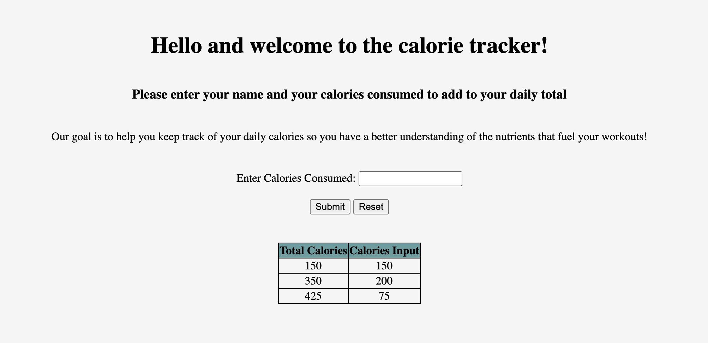
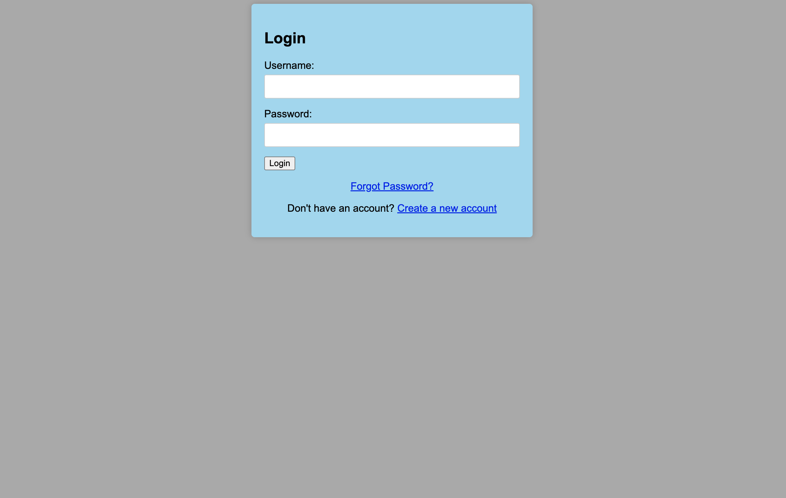

# Weekly Status

## Sprint 1: 2023-09-29 to 2023-10-05

### Billy

#### Project Visualization

### Dylan

Assisted in creation of calory input page
- edited css file for formatting

### Eric

Created rough draft html page.
- page took in simple input and provided output

### Jordon

- Combine HTML files
- Separate out CSS and JavaScript
- Write JavaScript for calculating calorie totals and creating new rows for each entry

### Will

##### Progress:

###### Database Design:
- Created an E/R (Entity-Relationship) diagram for the database schema that will serve as the foundation for our food lookup feature.
- The diagram helps to visualize the relationships and connections between various data entities that will be part of the database.

###### Documentation:
- Included a legend with the E/R diagram to ensure clarity in interpretation and understanding of the various symbols and relationships depicted.
- The diagram, along with its legend, has been stored in the `images/sprint_01` directory for reference.

## Sprint 2: 2023-10-06 to 2023-10-12

### Billy - Created Login and Create Account HTML pages.

### Dylan

Created user stories for nutrient/calory input page
Created "things to have" table based on user stories
- included input, output, input form type, what will this need columns
- "what will this need" column has loose ideas for what this will entail

### Eric

Create branch in repository for my feature (page).
Create rough outline for how an exercise input page will look
- What will this page output? (what are the most important items to show)
- Create testing to insure proper inputs
- plan time with Jordan to talk about how our pages will talk between each other, if that is still in our plans.
- 
### Jordon

- Brainstorm structure for storing workout, exercise, and sets information
- Collect list of machine weight lifting exercises

### Will

#### Food Lookup Feature

##### Progress:

###### Initial Setup & Integration with Flask:
- Successfully set up a Flask development framework for the Food Lookup Feature.
- Created a dedicated route for the food tracking page.

###### UI Design & Implementation:
- Designed a basic layout with an input field using `foodlookup.html`.
- Styled the page for a user-friendly experience.

###### Version Control:
- Created a `food_lookup` branch for feature-specific development.

###### Documentation:
- Documented the purpose and features of the `food_lookup.py` in code comments within the python file, to be referenced for later documentation.

##### Next Steps:

###### Set Up MySQL Connection with Flask:
- Establish a MySQL database for the project, which will store foods and their nutritional values.
- Connect the Flask app to this MySQL database using the Flask-MySQL extension.

###### Auto-populate to Relational Database:
- Implement functionality to detect user input in real-time in the food input field.
- Create backend logic to fetch matching food names based on user input and display them as suggestions.

##### Challenges/Blockers:
- The main challenge anticipated for the upcoming week is ensuring a smooth connection between Flask and MySQL, especially considering potential server and database configurations that might need adjustments.
- Constructing the database correctly that can/will be accessed by other team members will require good collaboration on the part of the team.
- Implementing the auto-populate feature requires synchronization between frontend and backend, ensuring efficient and relevant suggestions without overloading the database with frequent queries.

## Sprint 3: 2023-10-12 to 2023-10-19

### Billy - Created a Team3_flask_app.py file for webpage routing

Added a setup.cmds file to facilitate webpage viewing

Added a login development branch on git

### Dylan

Added macros inputs to cals input page
Worked on .js file to incorporate inputs into page table

#### Next Steps

Finish js file to move inputs and totals to page table
Have to develop database structure for maintaining history of user cal and macro inputs
- will include a button to add current page table as the input to the history

### Eric
###### Progress:
  Put together 1st draft of exercise input page, get basics implemented for input

###### Next Steps: 
  -create diagram/drawn interpretation of what I want the page to look like
  -figure out VScode hiccup that is preventing 
  -need to step back and create a better descriptions for page. Look to create 5 user stories to help narrow down exactly what features I want to implement.
  -set up basic layouts to pretty up page

### Jordon

#### Exercise Database Structure

Most of the data is in the sets table. Which workout and exercise each set belongs to comes from those corresponding foreign keys.

#### Preliminary Exercise Log Wireframe

This is a very early design. The idea is to list the workouts and be able to show and hide them.

### Will

#### Food Lookup Feature

##### Progress: 

- Created sample database food_database.db using SQLite. Contains one table (foods) with nutrition values, and three sample food items (avocados, onions, and salami)
- Created a create_food_db.py file to create database, print tables and data for debugging, and fill with sample data
- Modified foodlookup.html to include javascript that will allow for auto-population of user input when they input into the foodlookup page
- Added a route in food_lookup.py for querying of the database to allow for auto-population on /foodlookup page

##### Next Steps: 

- Alter backend database to include a food log that stores food that users log that they have consumed, and references the foods table for the nutritional information
- Add functionality for users to input which foods they ate and how much they ate, and update the food log accordingly
- - Include different units of measurement for users to input when they add food. 
- Add functionality for users to input their own food items into the database if they want to input a food that is not in the database

##### Challenges: 

- This will be a lot to implement, and I may not be able to get it all done at once.
- I am not planning on implementing error handling/input validation yet, so I should be careful about testing these features when I create them.
- More frontend and javascript will be necessary, and again I am not well-versed in this area.
- I will have to make sure altering my database schema makes sense and does not cause problems with what I already have. 

- I will have to make sure altering my database schema makes sense and does not cause problems with what I already have. 

## Sprint 4: 2023-10-20 to 2023-10-26

### Billy - 
* Created routes and rendered pages using flask on port 3308. 

* Verified data input and rendered three pages Login/Creat_Account/Reset_Password.

* Completed Milestone 4 and updated the wireframe with actual screenshots.

* Worked on adding stylesheets to html to render a page.

* Next week will work on database creation, entries, and edits.

### Dylan

* Completed Milestone 4 and created wireframe of page

* Worked on implementing output table with a running increment of inputs for each macro

* next week will finish html so output table works and will work on SQL diagram and logic

### Eric
* created wireframe and narrowed down parameters for page.
* will be looking how to create a db to save inputs for specific users

### Jordon

Created a more formalized SQL database structure for the exercise lo.

### Will

##### Progress:

- Added inputs on the foodlookup page to allow users to add food items to the database if they can't find their desired food for lookup.
- Made necessary tweaks in the backend to accommodate the creation and addition of new food data.
- Made adjustments to the frontend HTML template to include these new inputs.
- Currently, the page has empty buttons and placeholders for user input.

##### Next Steps:

- Complete the functionality for users to add food items to the database via the foodlookup page.
- Implement more comprehensive input validation for users adding food items to ensure data integrity and user experience.
- Delve deeper into Javascript implementation for this feature, ensuring seamless frontend and backend integration.

##### Challenges:

- The main challenge lies in implementing the required Javascript functionality, as it's an area I'm still familiarizing myself with.
- Ensuring that the modifications to the database and frontend don't introduce any unforeseen issues or bugs.
- Striking a balance between user-friendliness and data integrity as users gain the ability to add their own food items.
-->

## Sprint 5: 2023-10-26 to 2023-11-02

### Billy

* Fixed routes to render pages using flask on port 3308 with CSS. 

* Updated team ERD and solicited input regarding user information.

* Worked on Milestone 5 to create, edit, delete SQL entries.

* Created a basic SQL database file.

* Started unit testing for SQL database operations.

### Dylan

* finished working on data table and basic functionality for nutrient input page

* Figured out logic for database 
  * includes user history
  * includes food database for stored foods
    * can include a food dropdown from this and amount entry that fills in nutrient info for you?

* Next steps:
  * create flask file and routing info for page
  * begin working on creating SQL database
    * first write unit testing for database

### Eric
-Past week
* working on structure/organization and content of page.
* created separate divs and have all ID's created for css & js implementations

-Next week
* create routing informating for my page
* implent individual CSS page for organization 
* Work on scriptitng to fill tables with all data information that gets taken in
  
### Jordon

### Will
##### Progress:

- Re-organized code into separate css and javascript files for less clutter. 
- Adjusted html to allow for inputs of all nutrition items into database.

##### Next Steps:

- After web hosting tutorial lab, host my page and connect SQL database to flask app (will be much easier than what I've been attempting to do thus far with my own database file)
- Once page is hosted successfully, fully implement input validation and connect backend to frontend so users can interact with the database

##### Challenges:

- Ensuring backend and frontend integrate seamlessly
- Coming up with all required tests for input validation. 

## Sprint 6: 2023-11-02 to 2023-11-09

### Billy - 
* Created team 3 API file with functions to create, add, edit, delete entries from users database.

* Created test_team3API file with unit tests to make sure functions work as desired.

* Passed four tests and currently thinking of additional tests to add.

* Worked on input validation such as no duplicate login_names for add but need to add to edit.

* Next week will work on passing userID to other pages for them to access database. Will also work on rending live page with absolute minimal functionality. Will also create a javascript file to handle data inputs.

### Dylan

### Eric

### Jordon

### Will
##### Progress:

- Attempted test of using Render to host web service/database, ran into issues with personal test, requested outside assistance and currently waiting on answer from supervisor (Dr. Knox) and team decision

##### Next Steps:

- Create finalized backend database schema (merge and collaborate with team)
- Create SQL_Testing.md file for submission
- Collaborate with team to solve hosting issues and have backend database created (if not filled with relevant data)

##### Challenges:

- Team collaboration and scheduling
- Resolving logistical issues and timing
- Possible use of cloud service besides Render
<!-- 

## Sprint X: 2023-10-19 to 2023-10-26

### Billy - 
* Created routes and rendered pages using flask on port 3308. 

* Verified data input and rendered three pages Login/Creat_Account/Reset_Password.

* Completed Milestone 4 and updated the wireframe with actual screenshots.

* Worked on adding stylesheets to html to render a page.

* Next week will work on database creation, entries, and edits.

### Dylan

### Eric

### Jordon

### Will
-->

<!-- 
## Sprint X: 2023-MM-DD to 2023-MM-DD

### Billy

### Dylan

### Eric

### Jordon

### Will
-->

